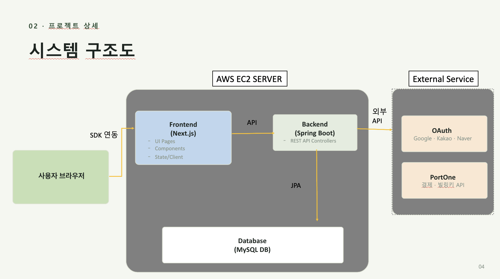
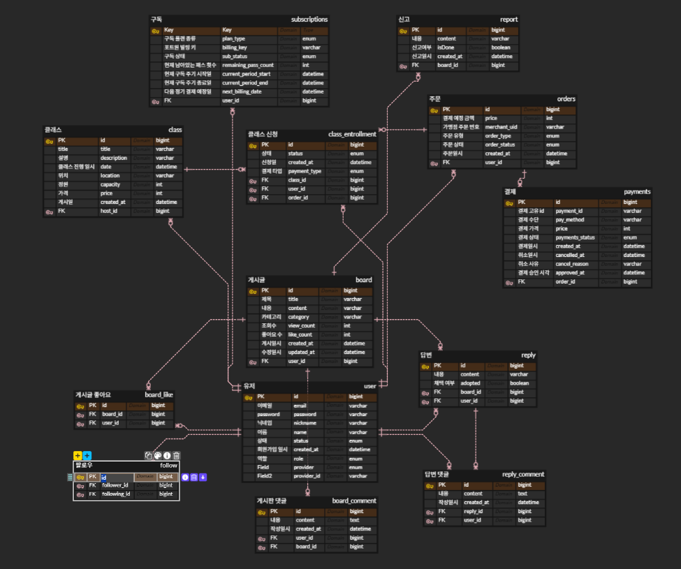

# 🌱 CityFarm (도시 농업 플랫폼)

> **Java 및 Spring Boot 기반의 텃밭 분양 및 커뮤니티 서비스**  
> 도시에서 쉽게 텃밭을 분양받고, 농업 관련 클래스와 소통을 즐길 수 있는 플랫폼입니다.

🔗 **[Project Notion (기획안 및 상세 문서)](https://app.notion.com/p/1-3ac73873401a803191ebeab3ce2f07eb)**

---

## 🛠 Tech Stack

### **Backend**
- Language: Java 21
- Framework: Spring Boot, Spring Security, Spring Data JPA
- Database: MySQL

### **Frontend**
- Framework: React, Next.js
- Styling: Tailwind CSS
- State Management: Zustand

### **Infra & DevOps**
- Cloud: AWS EC2 (`http://54.86.192.52`)
- Containerization: Docker, Docker Compose
- Version Control: Git / GitHub Actions

---

## 🚀 주요 기능 (Key Features)

* **사용자 및 권한 관리**
  * 일반 회원, 텃밭 호스트, 관리자(Admin) 권한 분리
  * 관리자 페이지를 통한 회원 상태 변경 및 전체 정산 관리

* **텃밭 및 클래스 분양**
  * 텃밭 조회, 상세 정보 확인 및 분양 신청

* **결제 및 정산 시스템**
  * 안전한 결제 처리 및 호스트 정산 내역 조회·지급 완료 처리 기능

* **커뮤니티**
  * 유저 간 소통을 위한 게시판 및 피드 기능

---

## 🏗 System Architecture

- **Client (Frontend):** Next.js / React 앱을 통해 사용자 요청 처리
- **Server (Backend):** AWS EC2 인스턴스 내부에서 Docker 컨테이너(Spring Boot)로 구동
- **Database:** MySQL 데이터베이스와 Spring Data JPA 연동

---

## 🗄 Database ERD

- **주요 엔티티:** User(회원), Farm(텃밭), Settlement(정산), Board/Feed(커뮤니티) 등
- 권한(ROLE: USER, HOST, ADMIN)에 따른 철저한 데이터 접근 통제 구조 설계

---

## 🔥 Troubleshooting & Key Challenges

🔗 **[트러블슈팅 상세 기록](https://app.notion.com/p/d5b73873401a83ca8a59811ed19e30d3)**

---

## 📦 Deployment

- **Server URL:** [http://54.86.192.52](http://54.86.192.52)
- Docker 기반의 컨테이너화를 통해 배포 환경 일치화 및 안정적인 서비스 운영 구현