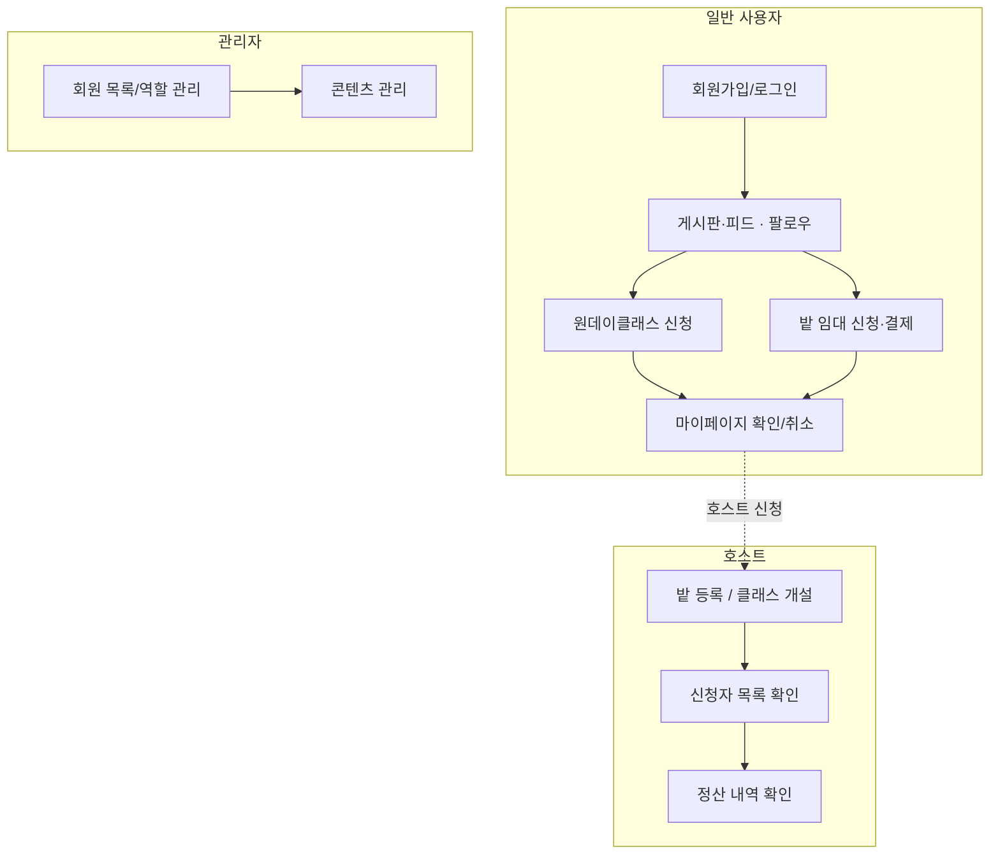

# 기혁이와 친구들 - 도시 귀농 전문 플랫폼 (City Farm)

## 01. 프로젝트 개요

| 항목       | 내용                                     |
| ---------- | ---------------------------------------- |
| 프로젝트명 | 도시 귀농 전문 플랫폼 (팜팜)             |
| 한 줄 소개 | 도시에서 소작농 전문가가 되어봅시다.     |
| 개발 기간  | 2025.07.29 ~ 08.27 (4주)                 |
| 팀원       | 전기혁,송시훈,곽승욱,김다솜,김종범 (5명) |
| 버전       | v1.0                                     |

---

| **항목**    | **값**          |
| ----------- | --------------- |
| Project     | Gradle - Groovy |
| Language    | Java            |
| Spring Boot | 3.5.xx          |
| Group       | `com.cityfarm`  |
| Artifact    | board           |
| Java        | 21              |

---

### 타겟 사용자

- 농작물을 작게 키우고 싶은 도시 소작농인
- 주말농장이나 텃밭을 경험하고 싶은 초보 농부

### 핵심 가치

- 농부 커뮤니티를 통해 재배 노하우 및 정보 공유

---

## 02. 핵심 사용자 흐름



## 핵심 기능

### 회원/인증

- 이메일 회원가입/로그인, 소셜 로그인(Google/Kakao/Naver)
- JWT 기반 인증 (Access/Refresh 토큰, 자동 재발급으로 세션 유지)
- 회원 탈퇴(소프트 삭제), USER → HOST 승격(사업자 정보 제출 시 즉시 전환)

### 게시판

- 카테고리별(공지/질문/자유) 게시글 작성·조회·수정·삭제
- 댓글/답글(답변) 작성, 게시글 좋아요
- 제목/작성자 검색, 공지사항 상단 고정

### 팔로우/피드

- 유저 팔로우/언팔로우
- 팔로우한 사용자의 게시글만 모아보는 피드

### 원데이클래스

- 클래스 목록 조회(일정순/최신순/가격순 정렬), 상세 조회
- 일반결제 또는 구독 수강권으로 신청
- 호스트: 클래스 개설, 설명 수정, 취소(신청자 전체 환불/수강권 복구), 신청자 목록 조회

### 구독

- 빌링키 등록(PortOne 정기결제)
- 구독 시작 시 매달 수강권 3개 자동 발급
- 구독 해지, 결제수단 관리

### 결제

- PortOne 연동 일반결제(원데이클래스, 밭 임대 공용)
- 결제 대기 상태 자동 만료 처리(TTL 30분, 배치 스케줄러)
- 결제 취소, 결제 내역 조회

### 밭/임대

- 밭 매물 등록·목록·상세 조회
- 임대 신청·결제, 임대 취소
- 호스트: 밭 관리(운영중/미운영 현황), 임차인 목록 조회

### 정산

- 호스트 정산 내역 조회

### 관리자

- 전체 회원 목록 조회, 역할/상태 변경(호스트 승격, 정지 등)
- 타인 게시글/클래스 관리(수정·삭제) 권한

---

## 03. 기술 스택

## 기술 스택

### Backend

- **Language/Runtime**: Java 21
- **Framework**: Spring Boot 3.5.16
- **Data**: Spring Data JPA, MySQL (운영), H2 (테스트)
- **인증/보안**: Spring Security, JWT (jjwt 0.12.6, Access/Refresh 토큰)
- **소셜 로그인**: OAuth2 Client (Google, Kakao, Naver)
- **결제**: PortOne V2 (일반결제 + 정기결제 빌링키)
- **API 문서화**: Springdoc OpenAPI (Swagger UI)
- **기타**: Lombok

### Frontend

- **Framework**: Next.js 16.3.0 (App Router, Turbopack)
- **UI 라이브러리**: React 19.2.8
- **상태 관리**: Zustand 5
- **스타일링**: Tailwind CSS v4

### Infra / DevOps

- **클라우드**: AWS EC2
- **컨테이너**: Docker, Docker Compose
- **CI/CD**: GitHub Actions
- **이미지 레지스트리**: GitHub Container Registry (GHCR)

---

## 04. 아키텍처

### 배포 구조

EC2 인스턴스 한 대에서 Docker Compose로 3개 컨테이너를 운영해요.

| 컨테이너          | 이미지      | 포트                  |
| ----------------- | ----------- | --------------------- |
| cityfarm-frontend | Next.js     | 80(외부) → 3000(내부) |
| cityfarm-backend  | Spring Boot | 8080                  |
| cityfarm-DB       | MySQL 8.0   | 3306                  |

### CI/CD 플로우

1. `feat/Docker` 브랜치에 push (backend/**, frontend-kjb/**, docker-compose.yml 경로 변경 시)
2. GitHub Actions가 변경된 서비스만 감지해 Docker 이미지 빌드
3. GHCR(GitHub Container Registry)에 이미지 push
4. EC2에 SSH 접속 → 최신 이미지 pull → 해당 컨테이너만 재기동

### 인증 흐름

- 로그인 성공 시 Access Token(1시간)과 Refresh Token(14일)을 함께 발급
- 프론트는 두 토큰을 localStorage에 저장, API 요청마다 Access Token을 Authorization 헤더(Bearer)로 전송
- Access Token 만료 시 Refresh Token으로 재발급받아 세션 유지

---

## 05. 프로젝트 구조

```
ProjectTeam_1/
├── backend/                 # Spring Boot 서버
│   └── src/main/java/com/team1/cityfarm/
│       ├── controller/       # REST API 엔드포인트
│       ├── service/          # 비즈니스 로직
│       ├── repository/       # JPA 리포지토리
│       ├── entity/           # DB 엔티티
│       ├── service/          # 비즈니스 로직
│       ├── repository/       # JPA 리포지토리
│       ├── entity/           # DB 엔티티
│       ├── dto/               # 요청/응답 DTO
│       ├── portone/          # PortOne 결제 연동
│       └── global/           # 공통 설정(Security, 예외처리, 응답 포맷 등)
│
├── frontend-kjb/             # Next.js 클라이언트
│   └── src/
│       ├── app/               # 페이지 라우트 (App Router)
│       │   ├── board/ class/ farms/ feed/ mypage/ payment/
│       │   ├── admin/ host/ profile/ subscr
│       ├── components/        # 공용 UI 컴포넌트
│       ├── lib/api/          # 백엔드 API 호출 함수
│       ├── store/            # Zustand 전역
│       └── utils/            # 포맷팅 등 유틸
│
├── docker-compose.yml         # 3개 컨테이너(frontend/backend/db) 정의
└── .github/workflows/         # CI/CD 파이프라인
```

---

## 06. 실행 방법

요구 사항

- JDK 21
- Node.js 20+
- Docker Desktop (배포 환경과 동일하게 실행하고 싶을 때)

환경 변수

backend: backend/src/main/resources/application-secret.yml을 직접 생성해야 해요 (gitignore 대상). DB 계정, JWT 시크릿, OAuth2(Google/Kakao/Naver) 키, PortOne 결제 키가 필요해요. 실제 값은 각자 발급받아 채우고 커밋하지 않습니다. (CI/CD에서는 GitHub Secrets에 저장된 값으로 빌드 시점에 자동 생성돼요.)

frontend-kjb: .env.local.example을 참고해 .env.local을 만드세요. 기본값(설정 안 하면) 공유 라이브 서버(http://54.86.192.52:8080)를 그대로 바라봐요.

Docker로 실행

docker compose up --build

- Frontend: http://localhost (80 포트)
- Backend: http://localhost:8080
- Swagger: http://localhost:8080/swagger-ui/index.html

로컬 개발 실행 (선택)

# 백엔드 (H2 인메모리 DB로 뜸 - 별도 DB 설치 불필요)

cd backend && ./gradlew bootRun

# 프론트엔드 (별도 터미널)

cd frontend-kjb && npm install && npm run dev

- Frontend(dev): http://localhost:3000
- Backend: http://localhost:8080
- H2 콘솔: http://localhost:8080/h2-console (JDBC URL jdbc:h2:mem:cityfarm, user sa, 비밀번호 없음)

테스트

cd backend
./gradlew test

---

## 팀과 기여

| 이름   | MVP1                                                                                         | MVP2                                           |
| ------ | -------------------------------------------------------------------------------------------- | ---------------------------------------------- |
| 전기혁 | 게시판 CRUD (좋아요, 북마크)                                                                 | 팔로우/피드 CRUD, 좋아요 목록조회              |
| 송시훈 | 관리자페이지, 답글, 공통 예외처리, 결제 및 구독 신청/관리 구현                               | 결제 (포트원 연동, 콜백/검증, fallback)        |
| 곽승욱 | 프로필 페이지, Swagger 컨벤션, Docker 및 CI/CD 파이프라인 초기 설정, OAuth2 소셜 로그인 구현 | OAuth2 (SocialAccount 연동)                    |
| 김다솜 | 회원/인증/로그인                                                                             | 밭 임대 CRUD, 임대신청(결제연동)               |
| 김종범 | 게시글·답글·댓글 CRUD (좋아요)                                                               | 원데이클래스 CRUD, 클래스 신청(결제/구독 연동) |

---

## Documentation

| 문서     | 위치                                  | 용도                                   |
| -------- | ------------------------------------- | -------------------------------------- |
| ERD      | docs/erd.png                          | 데이터 모델                            |
| 아키텍처 | docs/architecture.png                 | 시스템 구조도                          |
| 발표자료 | docs/presentation.pdf                 | 프로젝트 발표                          |
| API 문서 | Swagger UI (`/swagger-ui/index.html`) | 전체 API 명세 (로컬/서버 실행 시 확인) |

---

## 개선 계획

- 관리자용 전체 정산 내역 조회/지급완료 처리 화면 (현재 백엔드 없음, 프론트 UI도 미구현)
- 밭 임대 취소 시 호스트도 처리할 수 있는 프론트 UI (백엔드는 이미 지원하나 프론트에 버튼 없음)
- 팔로워/팔로잉 목록 조회 화면 (현재 숫자만 표시되고 목록 페이지 없음)
- `PaymentServiceTest` 컴파일 에러 수정 및 백엔드 테스트 커버리지 확대
- Frontend 자동화 테스트 도입

---

## 07. 트러블슈팅 (Troubleshooting)

프로젝트 개발 과정에서 발생한 핵심 문제 해결 경험입니다. 자세한 문제 상황과 해결 과정은 문서 링크에서 확인하실 수 있습니다.

### 💡 주요 트러블슈팅 요약

 📚 전체 트러블슈팅 리스트 (1 ~ 23)

| 번호 | 문서 제목 (주제) | 핵심 키워드 | 링크 |
| :---: | :--- | :--- | :---: |
| **01** | Merge Conflict | `Git` | [보기](./docs/troubleshooting/1.md) |
| **02** | 인증 모듈 중복 구현으로 인한 아키텍쳐 충돌 | `Git`, `Java` | [보기](./docs/troubleshooting/2.md) |
| **03** | .yaml 파일 | `Java` | [보기](./docs/troubleshooting/3.md) |
| **04** | 게시글 등록 schema 설정 | `Java` | [보기](./docs/troubleshooting/4.md) |
| **05** | 답변 등록 | `Java` | [보기](./docs/troubleshooting/5.md) |
| **06** | 목록 조회 시 불필요한 인증 요구 | `Java` | [보기](./docs/troubleshooting/6.md) |
| **07** | 답변/댓글이 달린 게시글 삭제가 안됨 | `Java` | [보기](./docs/troubleshooting/7.md) |
| **08** | 회원가입 안내 가이드 필요 | `JavaScript`, `React`, `Next.js` | [보기](./docs/troubleshooting/8.md) |
| **09** | 공지사항 답글/댓글 기능 삭제 | `Java` | [보기](./docs/troubleshooting/9.md) |
| **10** | OAuth 로그인 세션 만료 후 OAuth 재로그인 실패 | `Java` | [보기](./docs/troubleshooting/10.md) |
| **11** | 게시글 글자 수 제한 기능 | `Java` | [보기](./docs/troubleshooting/11.md) |
| **12** | 댓글과 답글의 위치 변경 | `React`, `Next.js` | [보기](./docs/troubleshooting/12.md) |
| **13** | 게시글 필터 정의 필요 | `Java` | [보기](./docs/troubleshooting/13.md) |
| **14** | 게시글 검색 기능 | `Java` | [보기](./docs/troubleshooting/14.md) |
| **15** | 비로그인 시 댓글칸이 입력되는 현상 | `Java` | [보기](./docs/troubleshooting/15.md) |
| **16** | 원데이클래스 설명 수정 | `Java` | [보기](./docs/troubleshooting/16.md) |
| **17** | 카드 등록 중 인증문자 미발송 | `API`, `Java` | [보기](./docs/troubleshooting/17.md) |
| **18** | icons.js 병합충돌 | `React`, `Next.js` | [보기](./docs/troubleshooting/18.md) |
| **19** | lib/api/profile.js 병합 충돌 | `JavaScript`, `Next.js` | [보기](./docs/troubleshooting/19.md) |
| **20** | 클래스 등록 폼 좌우 스크롤 | `Tailwind` | [보기](./docs/troubleshooting/20.md) |
| **21** | 회원탈퇴 안 됨 | `Java` | [보기](./docs/troubleshooting/21.md) |
| **22** | 회원탈퇴 ERROR 2 | `Java` | [보기](./docs/troubleshooting/22.md) |
| **23** | 장시간 로그인 후 재접속 시 자동 로그아웃되는 문제 | `React`, `Next.js`, `Tailwind` | [보기](./docs/troubleshooting/23.md) |