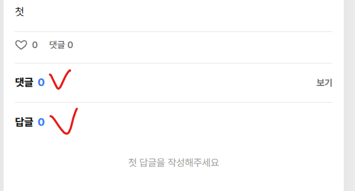

# 사례 12 - 댓글과 답급의 위치 변경

## 📌 문제 발생

1. 문제 유형 (핵심 태그) 정의

- 하단에 댓글 작성이 있는데 UI 상으로 댓글과 답글 부분의 변경 및 다른 방식의 처리가 필요할 것 같음

1. 어떤 기능에서 문제가 발생했는가?
   - 항상 발생

---

## 🔍 기대 결과

- UI상 댓글 부분이 잘 보이도록 수정이 필요할 것으로 보임

---

## 🔍 원인 분석

- 왜 발생했는가?
- 어떤 코드/구조에서 문제가 있었는가?

예:

- API 응답 전에 렌더링이 먼저 실행됨
- null 체크 없이 .length 접근

---

## 🛠 해결 방법

- 어떻게 해결했는가?

예:

- 옵셔널 체이닝 적용 (data?.length)
- early return으로 데이터 체크

---

## 🧠 배운점

- 트러블 슈팅을 통해 깨달은 부분
