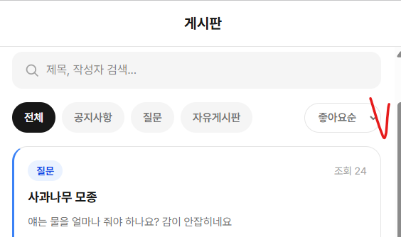
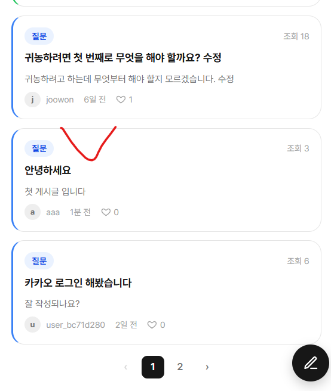

# 사례13 - 게시글 필터 정의 필요

## 📌 문제 발생

1. 문제 유형 (핵심 태그) 정의

- 게시글 입력 후 필터에 좋아요순으로 필터를 변경했을 때 필터 순서 확인이 필요 할 것 같다
- 예상하는 걸로는 좋아요 순 필터 기준으로 아래와 같이 되어 있는데 의도한 것 인지 확인 필요
  - 조회순도 포함한 필터가 추가 되어야 하지 않을까 하는 개인적인 생각
  1. 좋아요순이 높을 수록 최상당
  2. 게시글 올린 날짜순
  
  

1. 어떤 기능에서 문제가 발생했는가?
   - 항상 발생

---

## 🔍 기대 결과

- 게시글 필터 정리 필요

---

## 🔍 원인 분석

- 왜 발생했는가?
- 어떤 코드/구조에서 문제가 있었는가?

예:

- API 응답 전에 렌더링이 먼저 실행됨
- null 체크 없이 .length 접근

---

## 🛠 해결 방법

- 어떻게 해결했는가?

예:

- 옵셔널 체이닝 적용 (data?.length)
- early return으로 데이터 체크

---

## 🧠 배운점

- 트러블 슈팅을 통해 깨달은 부분
