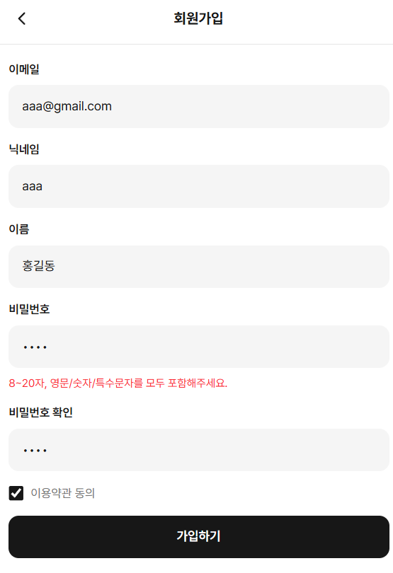

# 사례8 - 회원가입 안내 가이드 필요

## 📌 문제 발생

1. 문제 유형 (핵심 태그) 정의

- 회원 가입에 안내 가이드 문구가 없음

1. 어떤 기능에서 문제가 발생했는가?
    - 항상 발생

---

## 🔍 기대 결과

- 비밀번호 몇 개 조합 형식 (비밀번호 확인에는 필요 없음)
- 닉네임 최대 몇 자
- 이름 최대 몇 자

---

## 🔍 원인 분석

- 왜 발생했는가?
- 어떤 코드/구조에서 문제가 있었는가?

예:

- API 응답 전에 렌더링이 먼저 실행됨
- null 체크 없이 .length 접근

---

## 🛠 해결 방법

- 어떻게 해결했는가?

예:

- 옵셔널 체이닝 적용 (data?.length)
- early return으로 데이터 체크

---

## 🧠 배운점

- 트러블 슈팅을 통해 깨달은 부분